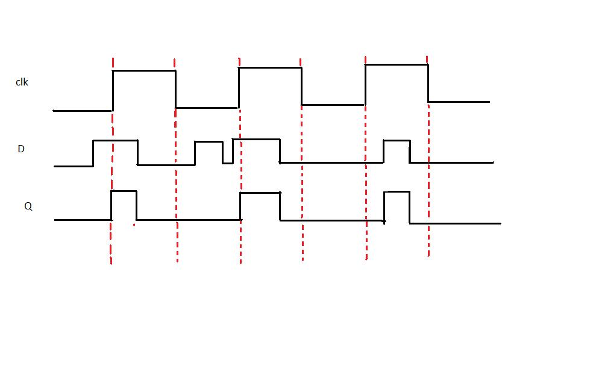

**D-LATCH**

Latch is an electronic device that can be used to store one bit of information. The D latch is used to capture, or 'latch' the logic level which is present on the Data line when the clock input is high. If the data on the D line changes state while the clock pulse is high, then the output, Q, follows the input, D. When the CLK input falls to logic 0, the last state of the D input is trapped and held in the latch.
Timing diagram

From the timing diagram it is clear that the output Q's waveform resembles that of input D's waveform when the clock is high whereas when the clock is low Q retains the previous value of D (the value before clock dropped down to 0)

**D FLIP FLOP**

The working of D flip flop is similar to the D latch except that the output of D Flip Flop takes the state of the D input at the moment of a positive edge at the clock pin (or negative edge if the clock input is active low) and delays it by one clock cycle. That's why, it is commonly known as a delay flip flop. The D FlipFlop can be interpreted as a delay line or zero order hold. The advantage of the D flip-flop over the D-type "transparent latch" is that the signal on the D input pin is captured the moment the flip-flop is clocked, and subsequent changes on the D input will be ignored until the next clock event.

Timing diagram

From the timing diagram it is clear that the output Q changes only at the positive edge.At each positive edge the output Q becomes equal to the input D at that instant and this value of Q is held untill the next positive edge

**Characteristics and applications of D latch and D Flip Flop :**

1. D-latch is a level Triggering device while D Flip Flop is an Edge triggering device.

2. The disadvantage of the D FF is its circuit size, which is about twice as large as that of a D latch. That's why, delay and power consumption in Flip flop is more as compared to D latch.

3. Latches are used as temporary buffers whereas flip flops are used as registers.

4. Flip flop can be considered as a basic memory cell because it stores the value on the data line with the advantage of the output being synchronized to a clock.

5. Many logic synthesis tool use only D flip flop or D latch.

6. FPGA contains edge triggered flip flops.

7. D flip flops are also used in finite state machines.

**Edge Triggering vs. Level Clocking**

1. When a circuit is edge triggered the output can change only on the rrising or falling edge of the clock. But in the case of level-clocked, the output can change when the clock is high (or low).

2. In edge triggering output can change only at one instant during the lock cycle; with level clocking output can change during an entire half cycle of the clock.

