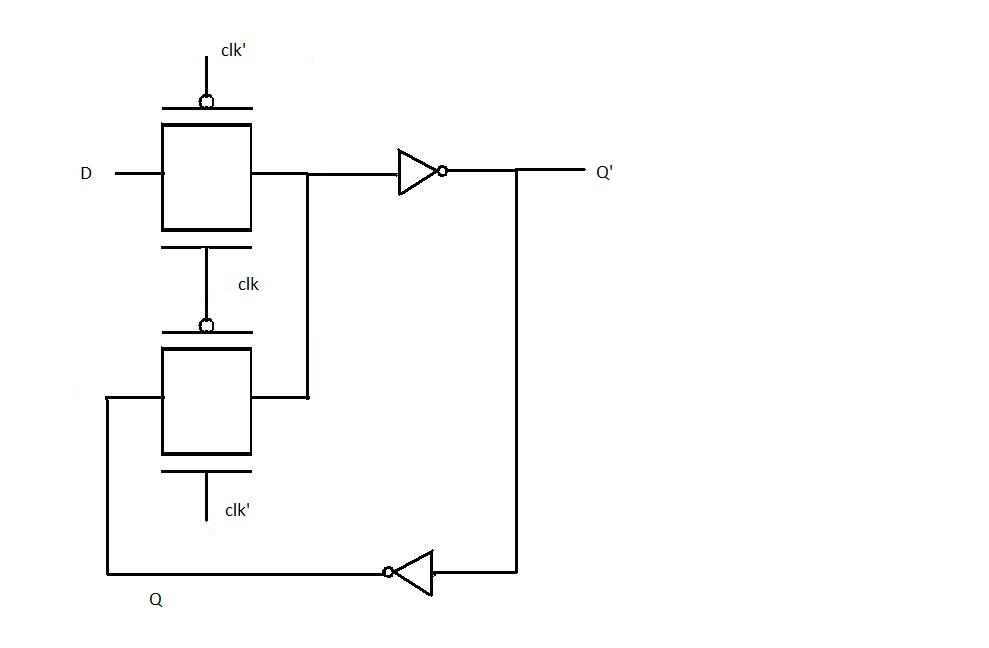
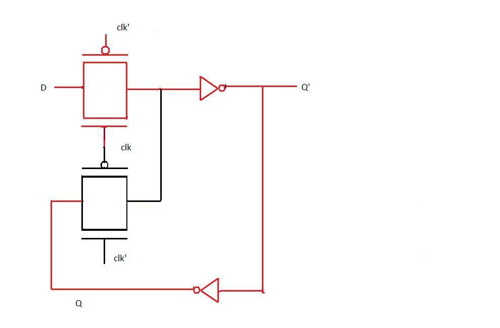
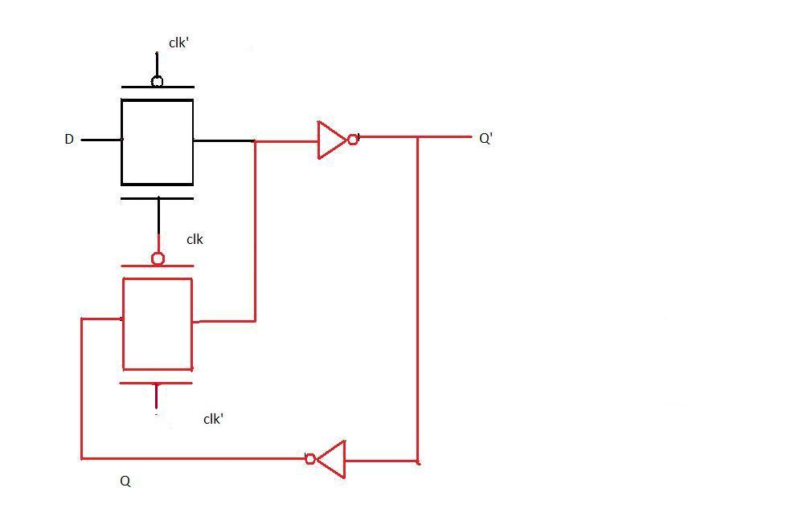
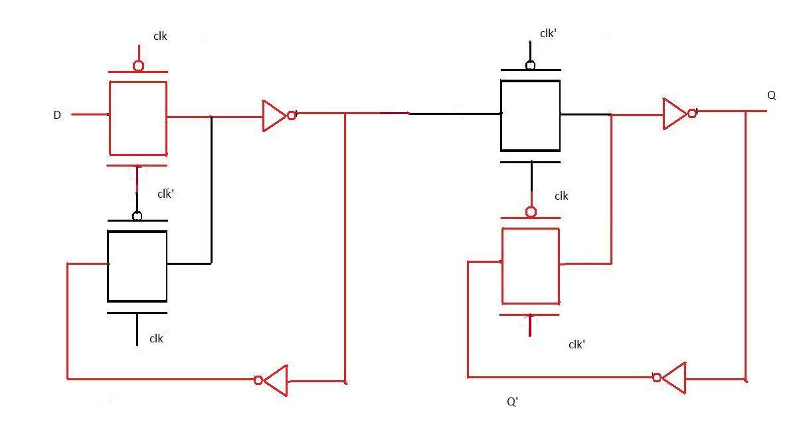
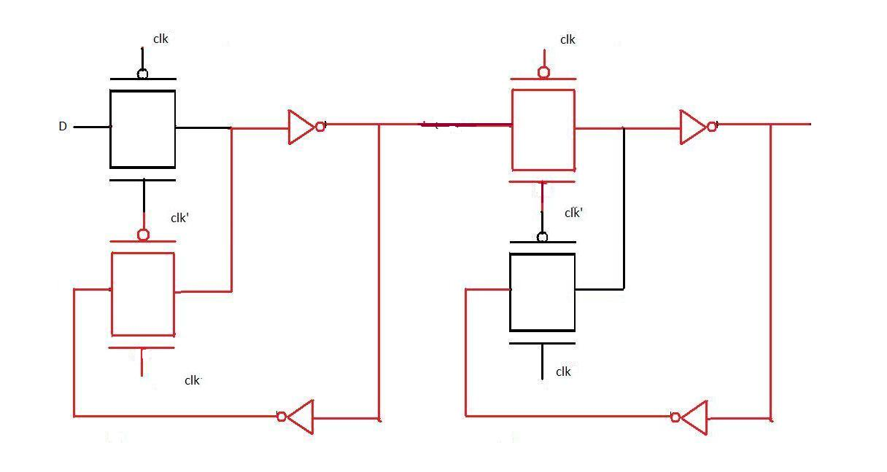

With the definition of D latch and D flip-flop(given in the introduction) and the background knowledge of pass transistor(acquired in the fourth experiment) let us design the transistor level diagram of D latch in this experiment. As mentioned earlier, when the clock is high the input D propagates to the output Q as it is and when the clock is low the output is held(irrespective of the changes in input D). This definition indicates that D latch can be implemented as a multiplexer with clock signal as the select input of multiplexer. Applying analogy, we realise that when clock=1 the input to the CMOS pass transistor should be D and when clock=0 the input to the pass transistor should be value of D just before the transition of clock from 1 to 0. To obtain the value of D just before transition a buffer is needed. The final design is given below:

  

**Working of the latch when clock is 1.**  

  

When clock is 1 the pass transistor in red is on (the input to the gate of nmos is 1 and to the gate of pmos is 0) therefore the output is D as D changes the output changes accordingly. The two inverters act as a buffer.  

**Working of the latch when clock is 0.**  

  

When clock is 0 the pass transistor in red is on and the one connected to the input D is off thus any changes in D does not affect the circuit. If we observe the transistor in red is connected to the buffer at the output which loops back to its input thus the same value occurs at Q' again and again till this pass transistor is on.  

**POSITIVE EDGE TRIGGERED FLIP FLOP**

From the introduction it is clear that for a positive edge triggered flip flop the changes in output occurs at the transition level. This is done by configuring two D latches in master slave configuration.A master slave D flip-flop is created by connecting two gated D latches in series, and inverting the clock input to one of them. It is called master slave because the second latch in the series only changes in response to a change in the first (master) latch. To understand the transistor level design of positive edge triggered flip flop study the two diagrams below  

**Positive edge triggered flip flop when clock=0**

  

As evident from the figure when clk is 0 the input D passes through the first level of pass transistor logic and held there because the second level does not pass on the value of D  

**Positive edge triggered flip flop when clock=1**  

  

When the clock input becomes 1, D(at that instant) is transferred to the output. Thereafter output Q does not change when D changes because D is not passed through the first level of pass transistor logic (as seen in the diagram). Now when the clock changes back to 1, Q still remains unaffected by the changes in D because it is now hindered by the second level of pass transistor. Thus we observe that Q remains unchanged for the entire clock cycle and changes only at the positive edge. Hence the above transistor level diagram implements positive edge triggered flip flop.  

**APPLICATION AND ADVANTAGES OF D- FLIP FLOP**

D flip flop can be considered as a basic memory cell because it stores the value on the data line with the advantage of the output being synchronised to a clock. D flip flops form the basis of shift registers that are used in many electronic device. Many logic synthesis tool use only D flip flop or D latch. FPGA contains edge triggered flip flops. D flip flops are also used in finite state machines.   
